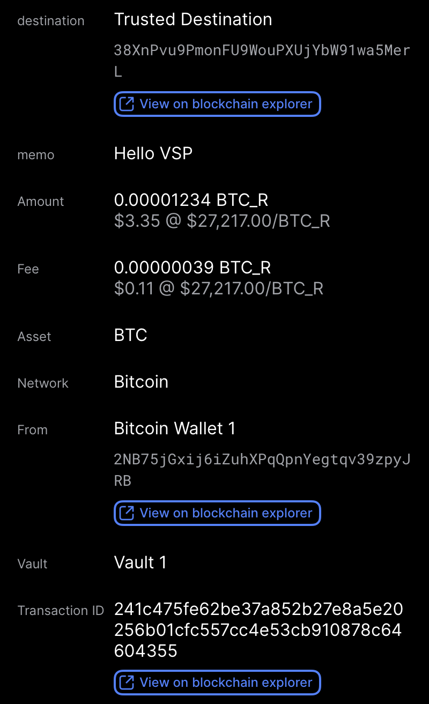
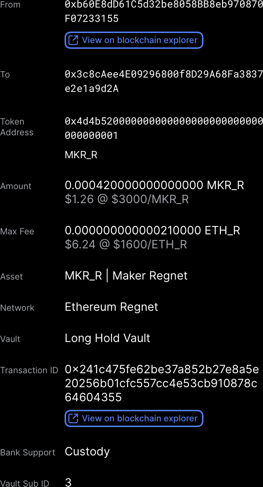
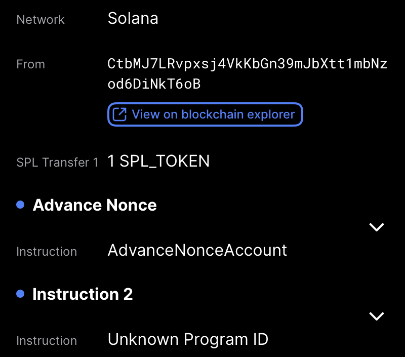
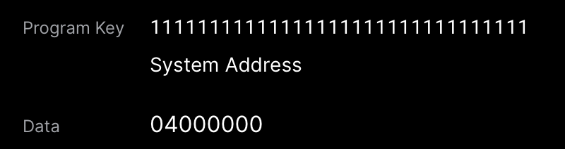
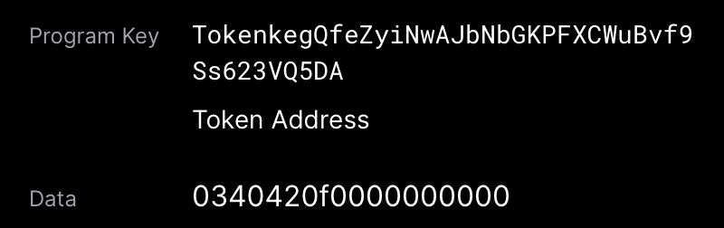

# Visual Sign Protocol Documentation
This document provides specifications for the Visual Sign Protocol (VSP), a structured format for displaying transaction details to users for approval. The VSP is designed to present meaningful, human-readable information about operations requiring signatures.

**Notes**
* We don't use v1 text field types, but they're around for backwards compatibilty for now
* AnnotatedFields are a layer on top of SignablePayload field for our wallet to provide more context, it's not in scope of the SignablePayload, it's still in structs but we'll consider removing in future

## SignablePayload
A SignablePayload is the core structure that defines what is displayed to the user during the signing process. It contains metadata about the transaction and a collection of fields representing the transaction details.

### Structure
<details> <summary>SignablePayload Structure</summary>

```json
{
  "Version": "0",
  "Title": "Withdraw",
  "Subtitle": "to 0x8a6e30eE13d06311a35f8fa16A950682A9998c71",
  "Fields": [
    {
      "FallbackText": "1 ETH",
      "Label": "Amount",
      "Type": "amount_v2",
      "AmountV2": {
        "Amount": "1",
        "Abbreviation": "ETH"
      }
    },
    ...
  ],
  "EndorsedParamsDigest": "DEADBEEFDEADBEEFDEADBEEFDEADBEEF",
}
```
</details>


### Payload Components

| Field                 | Type                       | Description                               |
|-----------------------|----------------------------|-------------------------------------------|
| Version               | String                     | Protocol version                          |
| Title                 | String                     | Primary title for the operation           |
| Subtitle              | String (optional)          | Secondary descriptive text                |
| PayloadType                | String | Identifier for the SignablePayload (ex: Withdrawal, Swap, etc)|
| Fields                | Array of SignablePayloadField | The fields containing transaction details |
| EndorsedParamsDigest  | String (optional)          | Digest of endorsed parameters             |

## Field Types
The Visual Sign Protocol supports various field types to represent different kinds of data.

#### Common Field Structure
All field types include these common properties:

<details> <summary>Common Field Properties</summary>

```json
{
  "Label": "Amount",
  "FallbackText": "1 ETH",
  "Type": "amount_v2"
}
```
</details>


| Field         | Type   | Description                                |
|---------------|--------|--------------------------------------------|
| Label         | String | Field label shown to the user              |
| FallbackText  | String | Plain text representation (for limited clients) |
| Type          | String | Type identifier for the field              |

### Specific Field Types


#### Text Fields
<details> <summary>Text Field Example</summary>

```json
{
  "Label": "Asset",
  "FallbackText": "ETH | Ethereum",
  "Type": "text_v2",
  "TextV2": {
    "Text": "ETH | Ethereum"
  }
}
```
</details>


#### Address Fields
<details> <summary>Address Field Example</summary>

```json
{
  "Label": "Amount",
  "FallbackText": "0.00001234",
  "Type": "amount_v2",
  "AmountV2": {
    "Amount": "0.00001234",
    "Abbreviation": "BTC"
  }
}
```
</details>

### Amount Fields
Amount fields are user friendly ways to display the value being transferred 
<details> <summary>Amount Field Example</summary>

```json
{
  "Label": "Amount",
  "FallbackText": "0.00001234 BTC",
  "Type": "amount_v2",
  "AmountV2": {
    "Amount": "0.00001234",
    "Abbreviation": "BTC"
  }
}
```
</details>

### Number Fields

<details> <summary>Number Field Example</summary>

```json
{
  "Label": "gasLimit",
  "FallbackText": "21000",
  "Type": "number",
  "Number": {
    "Value": "21000"
  }
}
```
</details>

### Divider Fields

Divider fields are UI elements to split the UI on. This is used for clarity and to allow the UI to keep views in separate pages if needed.

<details> <summary>Divider Field Example</summary>

```json
{
  "Label": "",
  "Type": "divider",
  "Divider": {
    "Style": "thin"
  }
}
```
</details>


### Layout Fields
We have additional layout fields for two different use cases - one for creating preview elements, where a condensed view can be optionally expanded by the user. 

<details> <summary>Preview Layout Field Example</summary>

```json
{
  "Type": "preview_layout",
  "PreviewLayout": {
    "Title": "Delegate",
    "Subtitle": "1 SOL Delegated to Jito4APyf642JPZPx3hGc6WWJ8zPKtRbRs4P815Awbb"
  },
  "Condensed": {
    "Fields": [ /* array of SignablePayloadFields */]
  },
  "Expanded": {
    "Fields": [ /* array of SignablePayloadFields */]
  }
}
```
</details> 


## Endorsed Params

The Endorsed Params feature allows passing additional parameters for the visualizer to interpret and potentially use for transforming the raw transaction to make meaningful display for user in a deterministic way. 

### Structure

Endorsed parameters are cryptographically bound to the SignablePayload through the `EndorsedParamsDigest` field, which contains a hash of all endorsed parameters. These are presented as an example - and may be chain or wallet-specific.

<details> <summary>Endorsed Params Structure</summary>

```json
{
  "EndorsedParams": {
    "ChainId": "1",
    "ContractAddress": "0x6B175474E89094C44Da98b954EedeAC495271d0F",
    "MethodSignature": "transfer(address,uint256)",
    "Nonce": "42",
    "CallData": "0xa9059cbb000000000000000000000000...",
    "ABIs": {},
    "IDLs": {}
  }
}
```
</details>

### Usage

1. **Transaction Construction**: The visualizer service collects all necessary parameters for constructing a valid transaction.

2. **Parameter Separation**: Parameters are separated into:
   - User-facing fields (included in the `Fields` array)
   - Hidden parameters (included in `EndorsedParams`)

3. **Digest Creation**: The service computes a hash of the endorsed parameters:
   ```
   EndorsedParamsDigest = sha256(serialize(EndorsedParams))
   ```

4. **Payload Assembly**: The digest is included in the SignablePayload, cryptographically binding the hidden parameters to the displayed information.

### Security Considerations

- The signer must verify that the `EndorsedParamsDigest` matches the endorsed parameters used for transaction construction
- Parameters that affect user funds or authorization should generally be displayed rather than hidden
- Implementations should document which parameters are endorsed vs. displayed to ensure transparency

### Example Use Cases

- Network fees and gas parameters
- Technical identifiers (contract addresses, chain IDs)
- Implementation-specific parameters (nonces, replay protection values)
- Method signatures and serialized call data


## Example Fixtures
Below are screenshots corresponding to specific fixture examples:

Bitcoin Withdraw


ERC20 Token Withdraw


Solana Withdraw with Expandable Preview Layouts

Expanding fields, these are expected to be shown when one of the expandable fields is clicked

1. 
2. 


### Implementation Considerations
Field Ordering: Fields should be displayed in the order they appear in the Fields array
Version Compatibility: Clients should check the Version field to ensure they can properly render the payload
Fallback Rendering: If a client doesn't understand a field type, it should fall back to displaying the FallbackText
Security: Implementations should validate the ReplayProtection and EndorsedParamsDigest values


#### Extending the Protocol

New field types can be added to the protocol by:

1. Defining a new type identifier
2. Specifying the structure for the new field type
3. Updating client implementations to handle the new field type
4. Incrementing the protocol version